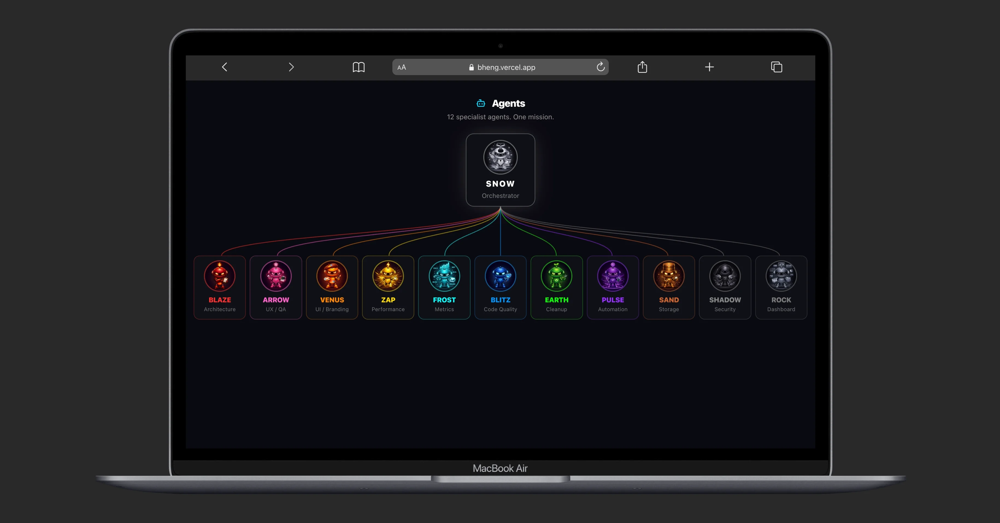

# Nexus - 12 AI Agent System

A structured multi-agent system for Claude Code. 12 specialist agents, each owns one concern, no overlap. Color-coded with clear roles, responsibilities, and memory.

## Live Demo

**[View the Agent Wiki](https://www.bunlongheng.com/ai/agents)** - interactive showcase with animations

## The 12 Agents

| # | Agent | Role | Color | Scope |
|---|-------|------|-------|-------|
| 1 | **Snow** | Orchestrator | White | Final approval, task assignment, full visibility |
| 2 | **Blaze** | Architecture | Red | System design, module boundaries, PR reviews |
| 3 | **Arrow** | UX / QA | Pink | E2E tests, accessibility, responsiveness |
| 4 | **Venus** | UI / Branding | Orange | Colors, typography, spacing, brand consistency |
| 5 | **Zap** | Performance | Yellow | Re-renders, bundles, Lighthouse, CLS, queries |
| 6 | **Frost** | Metrics | Cyan | Lighthouse tracking, bundle analysis, trends |
| 7 | **Blitz** | Code Quality | Blue | Unit tests, coverage, lint, type safety |
| 8 | **Earth** | Cleanup | Green | Dead code, deduplication, file organization |
| 9 | **Pulse** | Automation | Purple | CI pipelines, build gating, dev tooling |
| 10 | **Sand** | Storage | Brown | localStorage, Supabase, caching, migrations |
| 11 | **Shadow** | Security | Grey | Auth audits, XSS, headers, API security |
| 12 | **Rock** | Dashboard | Slate | Admin views, data tables, monitoring UI |

## How It Works

Each agent has a dedicated scope. When Claude Code works on your codebase, agents are invoked based on what's being touched:

- Editing a component? **Venus** checks branding, **Arrow** checks UX, **Blitz** checks types
- Adding an API route? **Shadow** audits security, **Sand** checks queries, **Zap** checks performance
- Deploying? **Pulse** verifies CI, **Frost** tracks metrics, **Snow** gives final approval

No agent steps on another's territory. Snow orchestrates everything.

## Usage

### As CLAUDE.md instructions

Copy `CLAUDE.md` into your project's root. Claude Code will automatically read it and apply the agent roles.

### As a Claude Code skill

Copy `.claude/commands/nexus.md` into your project. Then run `/nexus` in Claude Code to activate the agent system.

### As a JSON config

Use `agents.json` in your tooling, dashboards, or CI pipelines.

### As a React component

Drop `components/AgentWiki.tsx` into any Next.js app for an interactive agent wiki page.

## Built by

**[Bunlong Heng](https://www.bunlongheng.com)** - Full-Stack Developer

- [Portfolio](https://www.bunlongheng.com)
- [Agent Wiki (Live)](https://www.bunlongheng.com/ai/agents)
- [GitHub](https://github.com/bunlongheng)
