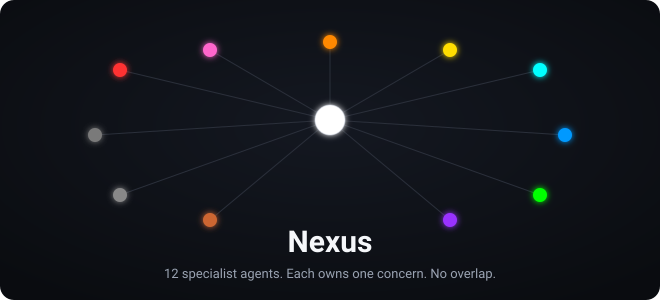
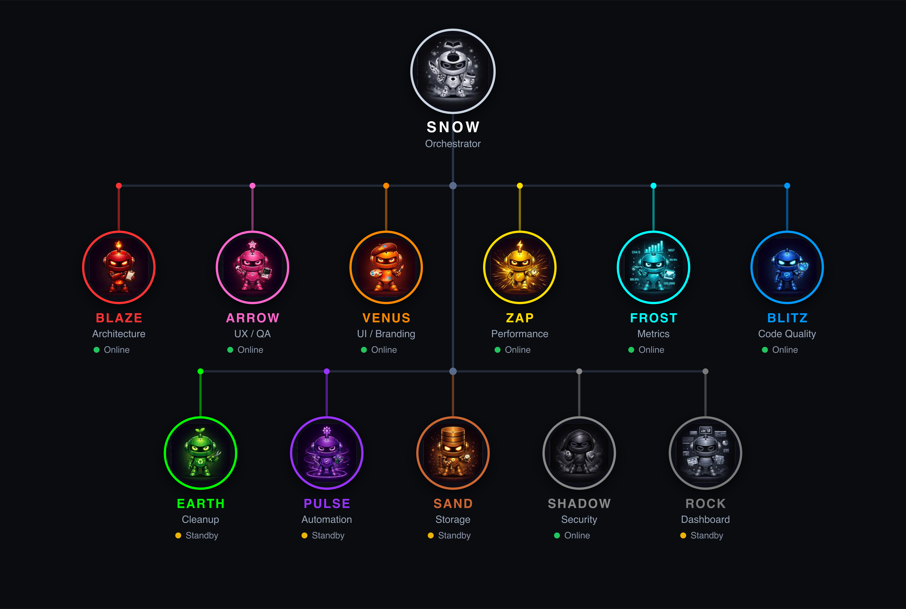
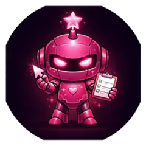
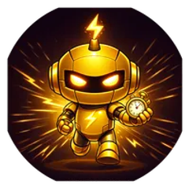
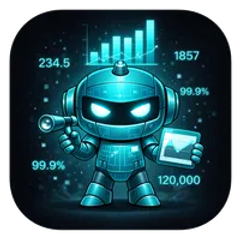
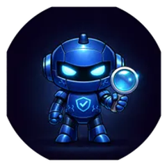
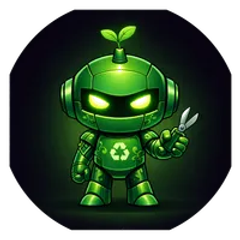
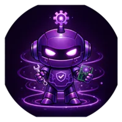

<div align="center">

# nexus

**A 12-agent specialist config pack for Claude Code.**

Twelve color-coded agents, each owning exactly one concern, with zero overlap.

[](LICENSE)




[View the live agent wiki](https://www.bunlongheng.com/ai/agents)

</div>

## Why

A single coding assistant tries to do everything at once: architecture, UX, performance,
security, cleanup. The concerns blur together and things slip through. Nexus splits the
work into 12 named specialists, each with a fixed scope. When Claude Code touches your
code, the relevant agents review their slice and nothing else. One orchestrator, Snow,
assigns work and gives final approval, so reviews stay structured instead of sprawling.

## Features

- 12 specialist agents, each owning one concern with no overlap
- Color-coded roles for instant recognition (white orchestrator, red architecture, and so on)
- Ships in four ready-to-use formats: `CLAUDE.md`, a `/nexus` skill, `agents.json`, and a React component
- A fixed report format so every agent answers in the same shape
- A single orchestrator (Snow) that assigns tasks and owns the final approval gate
- Drop-in, dependency-free, framework-agnostic

## The 12 agents

<div align="center">
  
</div>

Snow sits at the top as the orchestrator. The 11 specialists each own one slice and report up.

| Icon | # | Agent | Role | Color | Scope |
|:---:|---|-------|------|-------|-------|
|  | 1 | **Snow** | Orchestrator | White | Final approval, task assignment, full visibility |
|  | 2 | **Blaze** | Architecture | Red | System design, module boundaries, PR reviews |
|  | 3 | **Arrow** | UX / QA | Pink | E2E tests, accessibility, responsiveness |
|  | 4 | **Venus** | UI / Branding | Orange | Colors, typography, spacing, brand consistency |
|  | 5 | **Zap** | Performance | Yellow | Re-renders, bundles, Lighthouse, CLS, query efficiency |
|  | 6 | **Frost** | Metrics | Cyan | Lighthouse tracking, bundle analysis, quality trends |
|  | 7 | **Blitz** | Code Quality | Blue | Unit tests, coverage, lint, type safety |
|  | 8 | **Earth** | Cleanup | Green | Dead code, deduplication, file organization |
|  | 9 | **Pulse** | Automation | Purple | CI pipelines, build gating, dev tooling |
|  | 10 | **Sand** | Storage | Brown | localStorage, Supabase, caching, migrations |
|  | 11 | **Shadow** | Security | Grey | Auth audits, XSS, header hardening, API security |
|  | 12 | **Rock** | Dashboard | Slate | Admin views, data tables, monitoring UI |

## Install

Clone the repo and copy whichever format you want into your project:

```bash
git clone https://github.com/bunlongheng/nexus
```

| File | Use it as |
|---|---|
| `CLAUDE.md` | Project instructions Claude Code reads automatically |
| `.claude/commands/nexus.md` | A `/nexus` slash command skill |
| `agents.json` | Machine-readable config for tooling, dashboards, or CI |
| `components/AgentWiki.tsx` | An interactive React wiki for a Next.js app |

## Quick start

**As `CLAUDE.md` instructions.** Copy `CLAUDE.md` into your project root. Claude Code reads
it on every session and applies the agent roles automatically.

**As a Claude Code skill.** Copy `.claude/commands/nexus.md` into your project, then run
`/nexus` in Claude Code to load the 12-agent system for that session.

**As a JSON config.** Import `agents.json` into your own tooling, dashboards, or CI
pipelines. It holds each agent's id, name, role, color, scope, and description.

**As a React component.** Drop `components/AgentWiki.tsx` into a Next.js app for an
interactive, animated agent wiki page.

## How it works

Each agent has a dedicated scope, so reviews never collide:

- Editing a component? **Venus** checks branding, **Arrow** checks UX, **Blitz** checks types.
- Adding an API route? **Shadow** audits security, **Sand** checks queries, **Zap** checks performance.
- Deploying? **Pulse** verifies CI, **Frost** tracks metrics, **Snow** gives final approval.

No agent steps on another's territory, and Snow orchestrates the whole flow. Every agent
answers in the same fixed report format: an H1 title, ALL-CAPS section headers, dash
bullets, and a closing `SUMMARY` of 3 to 6 bullets, so output stays scannable no matter
which specialist produced it.

## License

[MIT](LICENSE)
